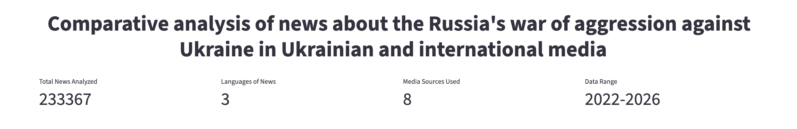
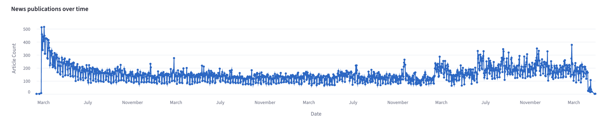
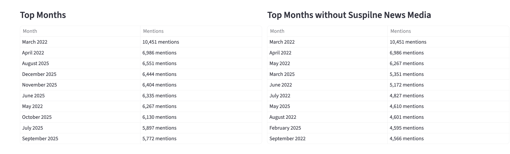
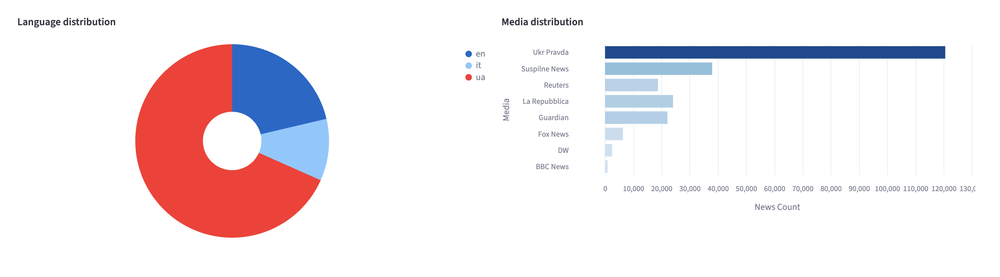
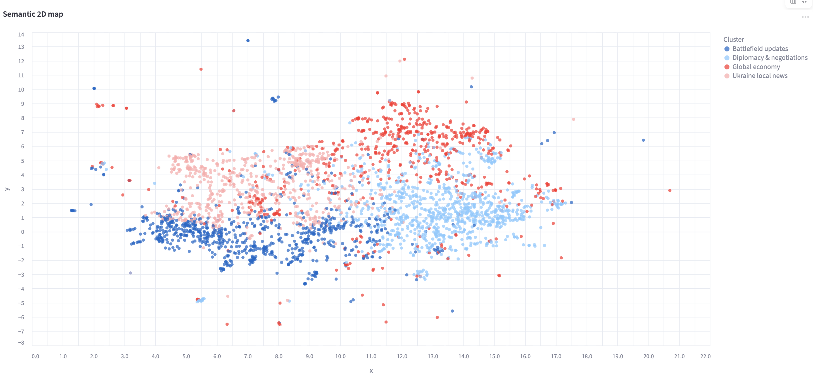
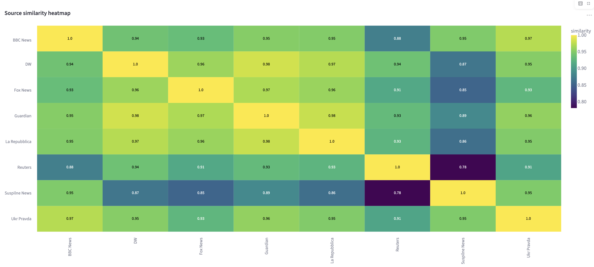
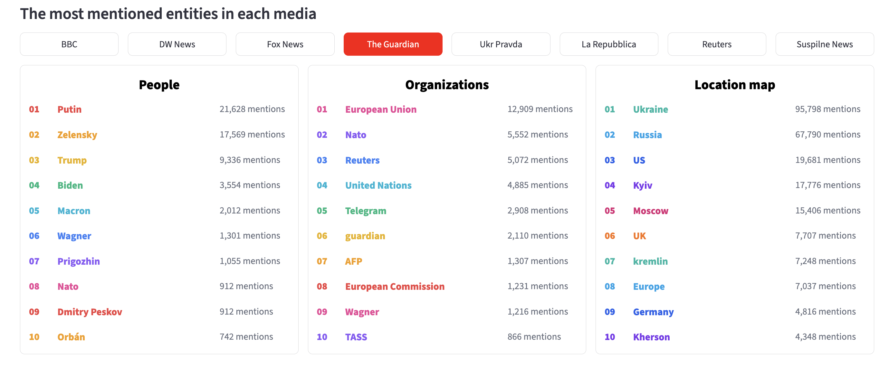
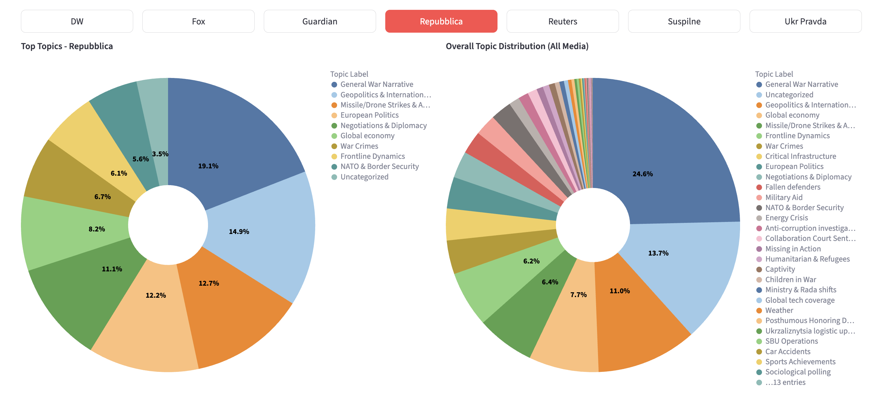
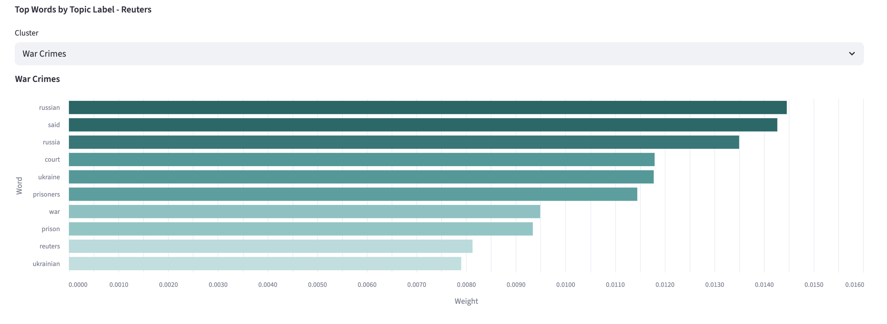
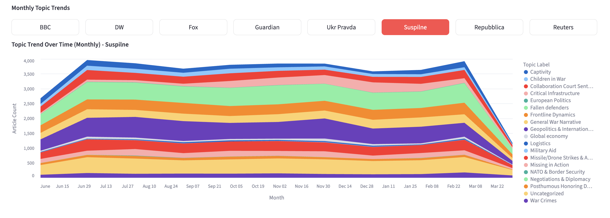

# Comparative analysis of news about the Russia's war of aggression against Ukraine in Ukrainian and international media using NLP methods.

### Overview
Russia’s full-scale invasion of Ukraine, which began in February 2022, has become one of the most widely covered events in the media space, both locally and globally. A huge amount of news is published daily and is growing rapidly as a result of the global information age. At the same time, the question arises: how do different publications cover events in Ukraine? Carrying out a comparative analysis is of important not only academic, but also strategic importance for understanding information influence and shaping public opinion.

### Chosen media
There were selected 8 news sources, 3 of which are Ukrainian. International media include famous outlets from  USA, Germany, Britain and Italy. This mix covers different languages and audiences making comparison meaningful and more rich.

### General framework of research
1. Data collection using web scraping
2. Data preprocessing and preparation
3. Media selection
4. Transformer-based Topic modeling and Named entity recognition
5. Implementation of analytical dashboard
6. Analysis of results and conclusions

The thesis consists of four main components: data collection, data preparation, NLP implementation, and dashboard development. Due to the scope of each stage, this repository highlights the most relevant part: the results of the news analysis presented via the dashboard.

### Methods and technologies used
1. Beautifulsoup4, Selenium, Playwright are used for web scraping.
2. BERTopic as a primary model for Topic modeling.
3. Multilingual-MiniLM-L12-v2 as an embedding model to create embeddings that were used in topic modeling, and also to explore semantic similarity.
4. XLM-RoBERTa-UK and BERT-BASE-NER for Named Entity Recogntition
Streamlit for dashboard implementation

### Dashboard
To make the analysis interpretable, an interactive dashboard was implemented. It provides a comprehensive cross-source view of how major Ukrainian and international media frame the war. 

The first part of dashboard is exploratory data analysis of news texts. In this section there were given answers to some questions.
1. KPI metrics: how many news were used for the analysis, number of languages, news data range and number of media sources.

2. It is also possible to check news publication dynamics over time, what periods are the most rich in news, what is the language and media distribution of news and some more.

3. The semantic map visualizes the embedding space, showing similarity between news articles. Based on clustering, several main groups were identified, including Global Economy, Frontline Updates, Diplomacy and Negotiations, and Ukrainian Local News. 

4. The similarity heatmap indicates strong alignment between The Guardian, DW News, and La Repubblica. In contrast, Suspilne News shows the most distinct framing compared to other media sources.

5. Entities extraction were highlighted in lists of the most mentioned actors, organizations and locations in each media. International media more frequently emphasize transnational actors and institutions. Ukrainian media more often surface locally meaningful actors and places with immediate relevance to domestic audiences. Across all sources, there are same key figures — Putin, Trump, and Zelensky — which reflects their central role in war coverage. However, each media outlet has a different focus. International media tend to highlight global politics and institutions. For example, Reuters focuses on economic organizations, DW includes attention to China, and Fox News emphasizes U.S. politics. European outlets like La Repubblica and The Guardian focus more on European leaders and Russian decision-making centers.In contrast, Ukrainian media focus more on local context — including national institutions, frontline areas, and people directly involved in the war.

6. Topic modeling results are presented in three different ways. The first visualization is topic distribution of news in general and for each media separately. It turned out that themes such as “General War Narrative” and “Geopolitics & International leaders” together with “Global Economy” are the most prominent news at all. Nearly 14% of news are uncategorized due to BERTopic results.

7. For each topic cluster there is visualization of key words with the biggest probability. Also, topic trend over time for each media was built to show which topics are changing in its priority over time. Each media keeps a persistent topic cluster, but in tidal topics shift across time with clear peaks and declines to major war phases.

### Conclusions
- More than 200.000 news were collected and used for analysis.
- Roughly 69% of data in Ukrainian, 21% in English and 10 in Italian.
- La Repubblica uses liveblog format with short posts, Ukrainian media,The Guardian and Reuters have mixed news formats, other media use article style format.
- The biggest dataset collections are from Ukrainian media, covering more than 160,000 news.
- Most frequently media such as Suspilne news, Ukrainska Pravda and La Repubblica publish their news on the war.
- The biggest peak of published news was spotted on the beginning of full scale-invasion, other peaks relate during the data range relate to main events.
- European media (DW News, The Guardian, La Repubblica) indicate very similar thematic framing, while Ukrainian media Suspilne News appears the most differentiated source in the dataset.
- Across all media, a common thematic core appears “Geopolitics & International Leaders”, covering leadership decisions and war developments. Ukrainian media focus more on frontline events, human impact, and domestic context, while international media emphasize geopolitical interpretation, diplomacy, and global implications.
- Ukrainian media highlight local actors, institutions, and locations, reflecting direct involvement in the conflict. In contrast, international media focus more on global political figures and organizations such as NATO and the EU.
